# pgAdmin Setup Guide

## English Version

### Accessing pgAdmin Site

1. Open a web browser and navigate to `http://localhost:5050`.
2. Log in using the provided credentials:
    - **Username:** admin@clontify.com
    - **Password:** admin
      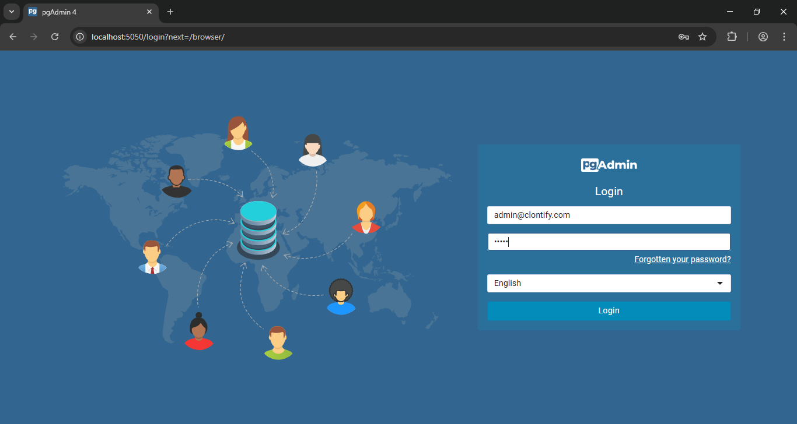

### Adding the Database Server

1. Click on **"Add New Server"** in the pgAdmin dashboard.
   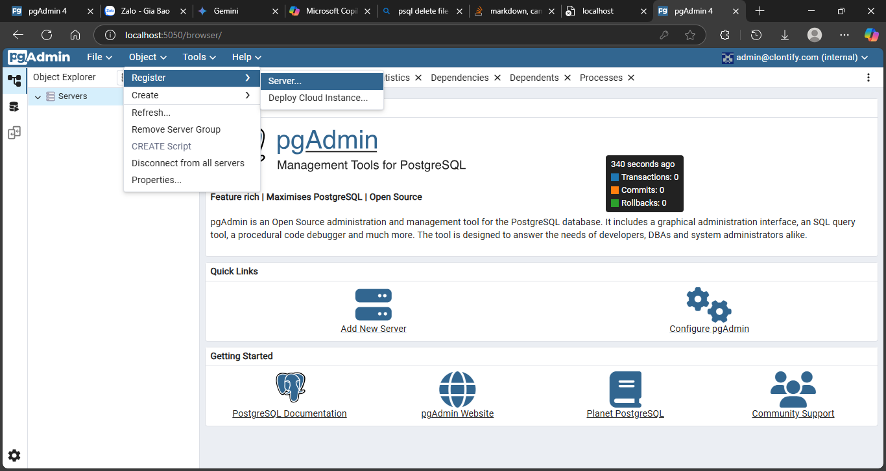
2. In the **General** tab, fill in:
    - **Name:** postgres
      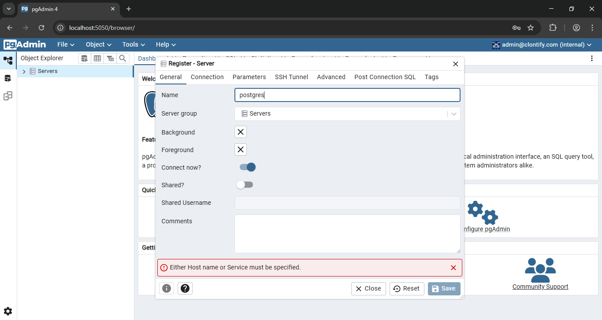

### Configuring the Connection

1. Go to the **Connection** tab.
2. Enter the following values:

    - **Host name/address:** postgres
    - **Port:** 5432
    - **Maintenance database:** postgres
    - **Username:** admin
    - **Password:** admin
      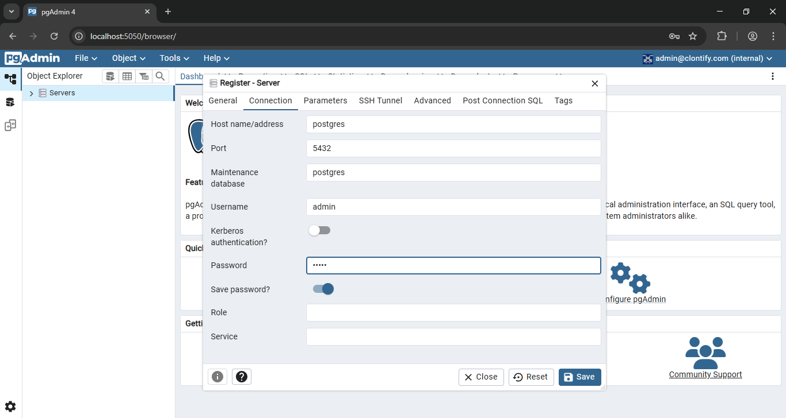

3. Keep other fields as default and click **Save**.

### Testing the Connection

1. After saving, the server should appear in the left sidebar.
2. Click on the server name to expand it.
3. If successful, databases will be listed under the server.
   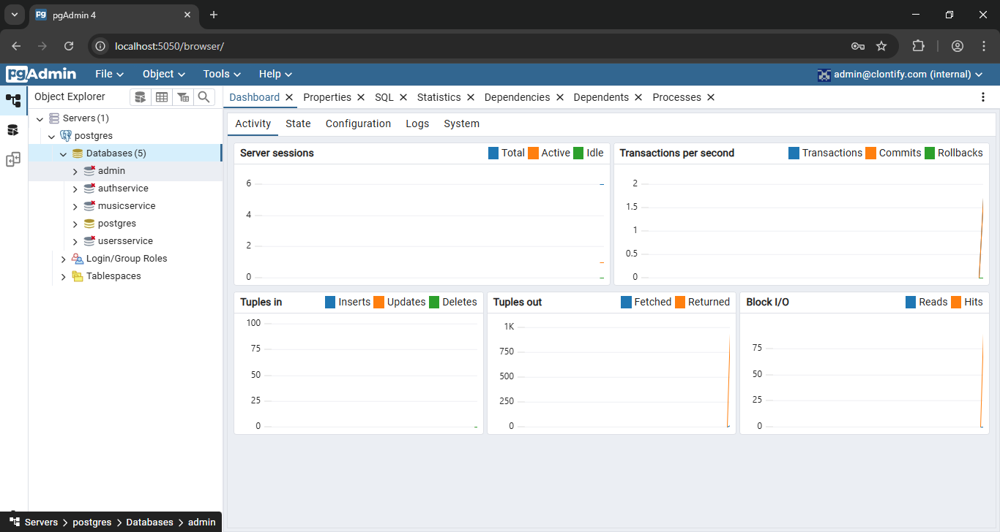

---

## Vietnamese Version

### Truy cập trang pgAdmin

1. Mở trình duyệt web và truy cập `http://localhost:5050`.
2. Đăng nhập bằng thông tin sau:
    - **Tên đăng nhập:** admin@clontify.com
    - **Mật khẩu:** admin
      

### Thêm máy chủ cơ sở dữ liệu

1. Nhấp vào **"Add New Server"** trên bảng điều khiển pgAdmin.
2. Trong tab **General**, nhập:
    - **Tên:** postgres
      

### Cấu hình kết nối

1. Chuyển sang tab **Connection**.
2. Điền các trường với thông tin sau:

    - **Host name/address:** postgres
    - **Port:** 5432
    - **Maintenance database:** postgres
    - **Tên đăng nhập:** admin
    - **Mật khẩu:** admin
      

3. Giữ nguyên các trường khác và nhấp **Save**.

### Kiểm tra kết nối

1. Sau khi lưu, máy chủ sẽ xuất hiện ở thanh bên trái.
2. Nhấp vào tên máy chủ để mở rộng.
3. Nếu kết nối thành công, bạn sẽ thấy danh sách cơ sở dữ liệu dưới máy chủ.
   

# Database Backup and Restore Guide

## English Version

### Backup Process

1. Open pgAdmin and navigate to the PostgreSQL server.
2. Right-click on the server and select **Backup**.
   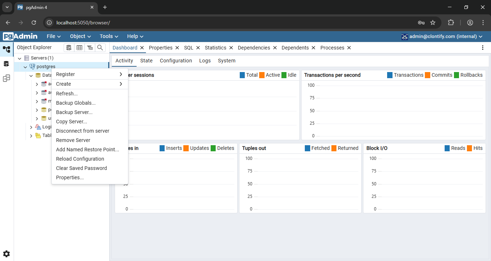
3. In the **General** tab:
    - Set **File Name** to `serverclontify.sql`.
    - Set **Role** to `admin`.
      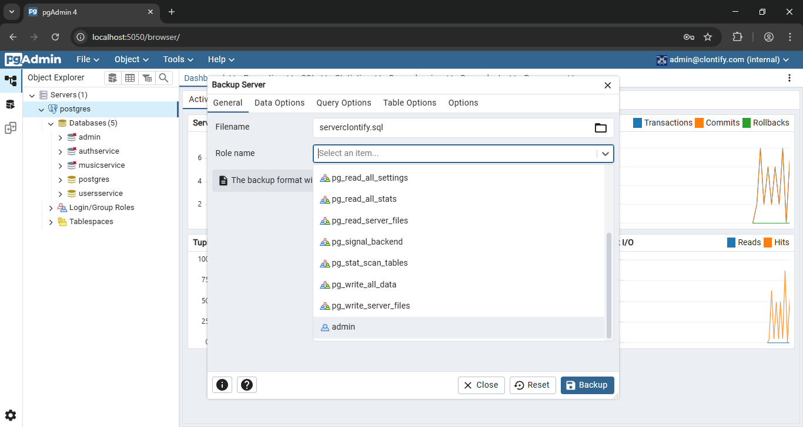
4. Go to the **Query Options** tab.
    - Ensure the settings match the following:
        - **Use INSERT Commands:** Disabled
        - **Maximum rows per INSERT command:** Leave empty
        - **On conflict do nothing to INSERT command:** Disabled
        - **Include DROP DATABASE statement:** Enabled
        - **Include IF EXISTS clause:** Enabled
          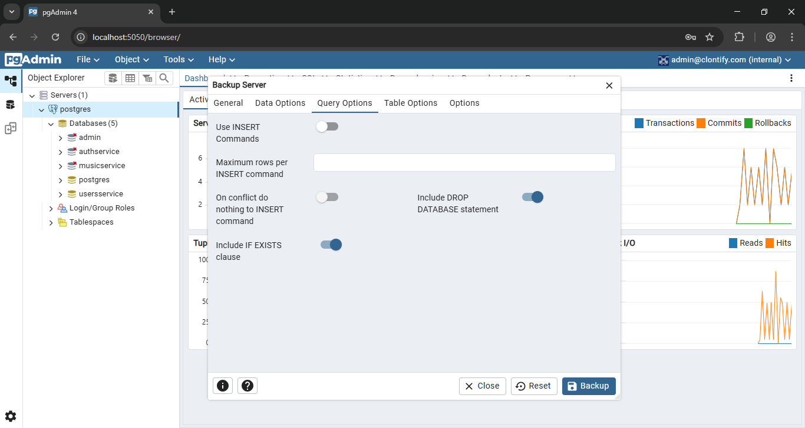
5. Click **Backup** to generate the file.
   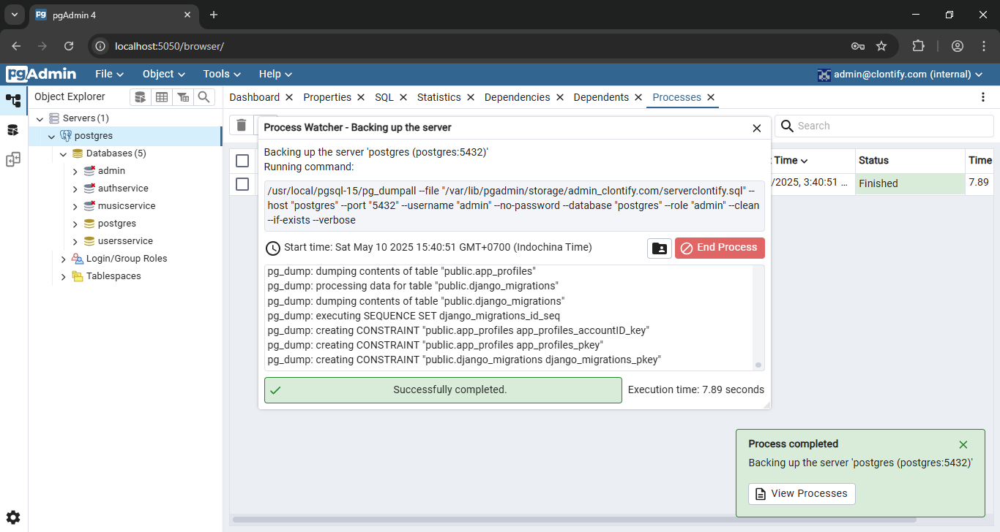
6. Move the backup file `serverclontify.sql` to the root directory of the backend server (`clontify-server`).
   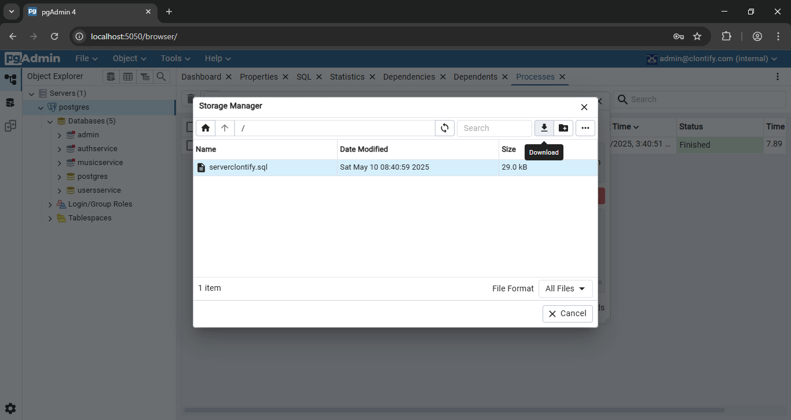

### Restore Process

1. Open Docker Desktop and select the PostgreSQL container.
   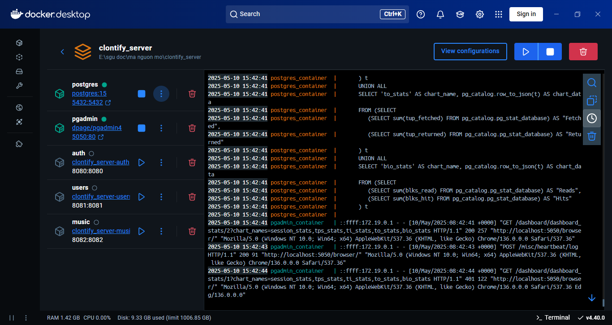
2. Navigate to the **Exec** tab.

3. Run the following command:
    ```sh
    psql -U admin -X -f /serverclontify.sql -d postgres
    ```
    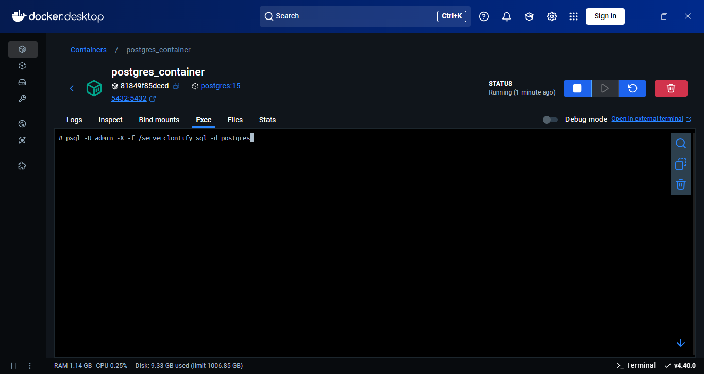
4. Wait for the process to complete. The database is now restored.
   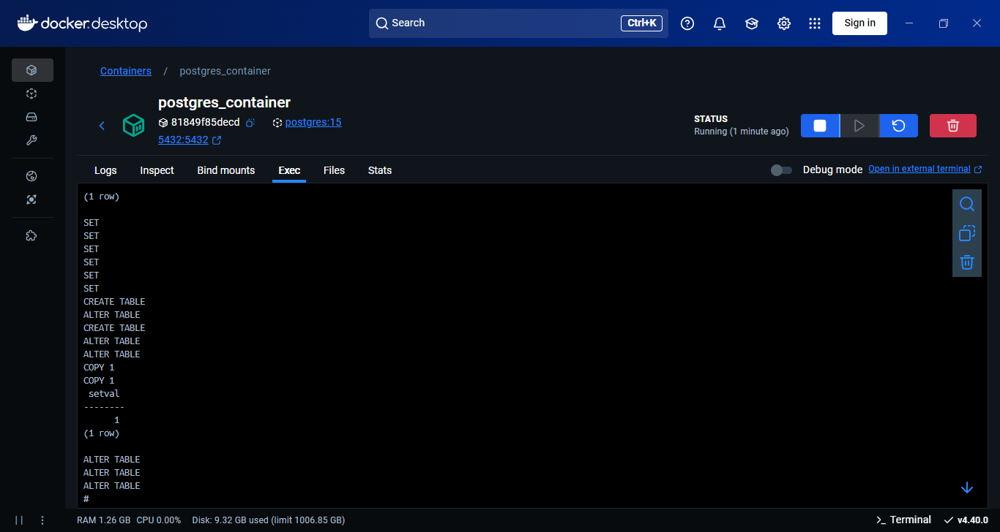

---

## Vietnamese Version

### Quá trình sao lưu

1. Mở pgAdmin và điều hướng đến máy chủ PostgreSQL.
2. Nhấp chuột phải vào máy chủ và chọn **Backup**.
   

3. Trong tab **General**:

    - Đặt **File Name** là `serverclontify.sql`.
    - Đặt **Role** là `admin`.
      

4. Chuyển sang tab **Query Options**.

    - Đảm bảo các cài đặt sau:
        - **Use INSERT Commands:** Tắt
        - **Maximum rows per INSERT command:** Để trống
        - **On conflict do nothing to INSERT command:** Tắt
        - **Include DROP DATABASE statement:** Bật
        - **Include IF EXISTS clause:** Bật
          

5. Nhấn **Backup** để tạo tập tin sao lưu.
   
6. Chuyển tập tin sao lưu `serverclontify.sql` vào thư mục gốc của máy chủ backend (`clontify-server`).
   

### Quá trình khôi phục

1.  Mở Docker Desktop và chọn container PostgreSQL.
2.  Chuyển đến tab **Exec**.
    

3.  Chạy lệnh sau:

    ```sh
    psql -U admin -X -f /serverclontify.sql -d postgres
    ```

    

4.  Chờ quá trình hoàn tất. Cơ sở dữ liệu đã được khôi phục.
    
